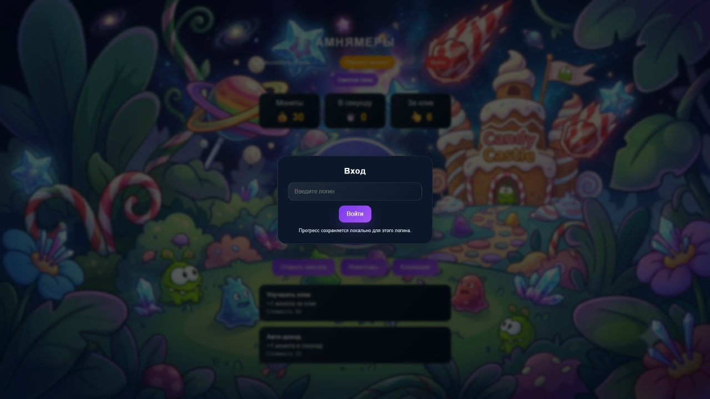
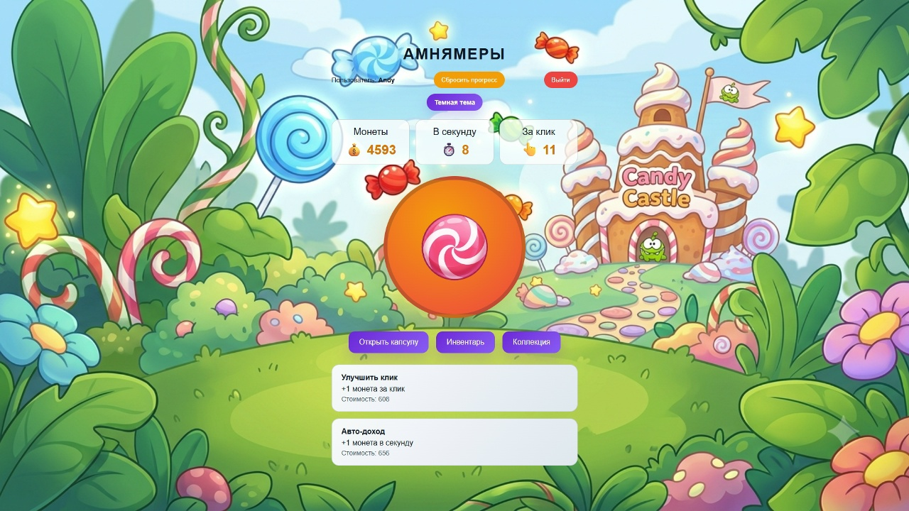
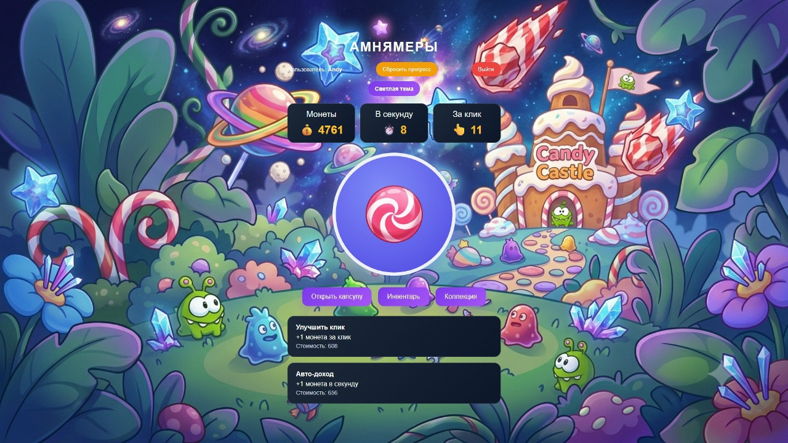
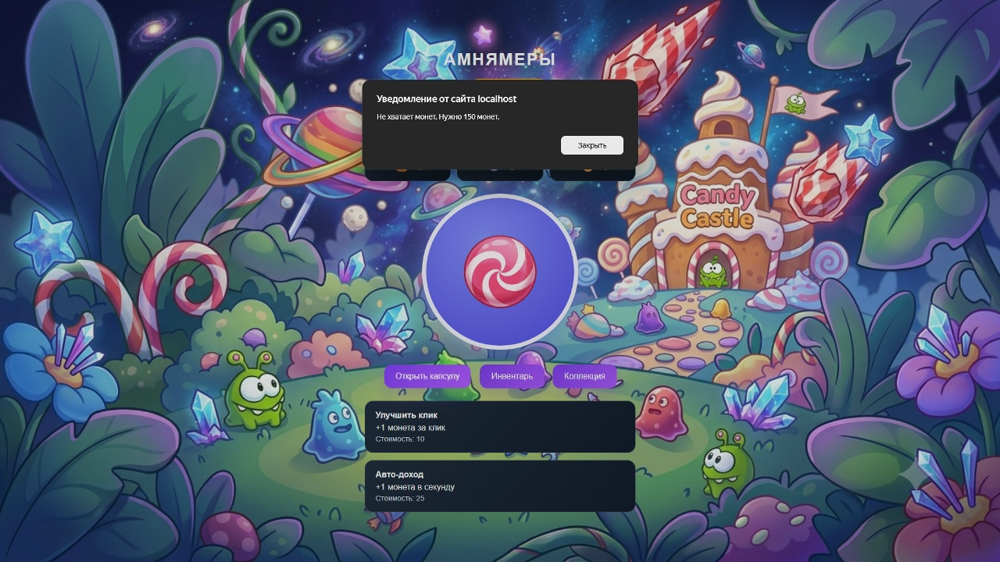
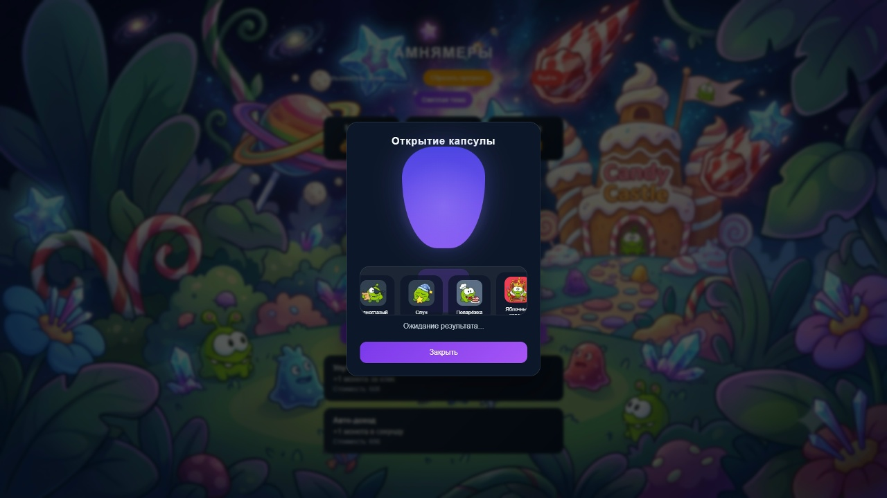
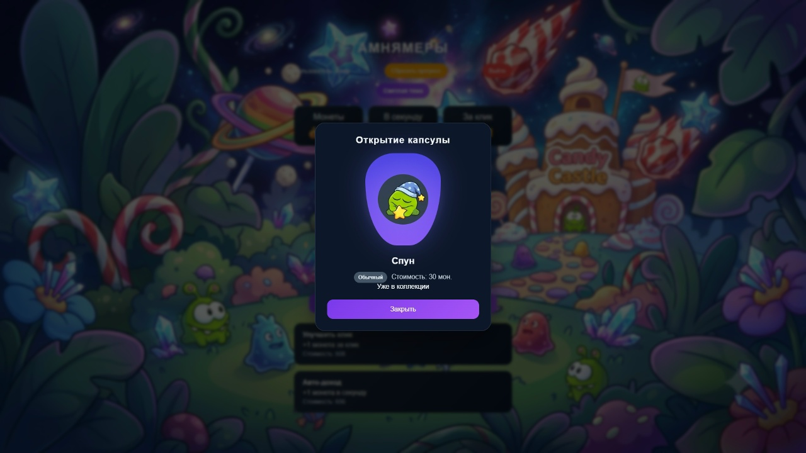
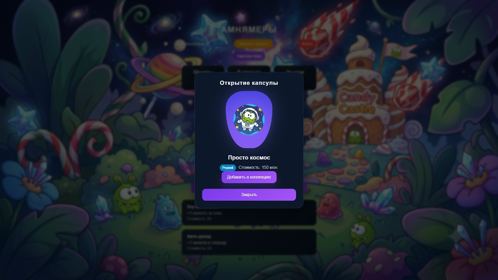
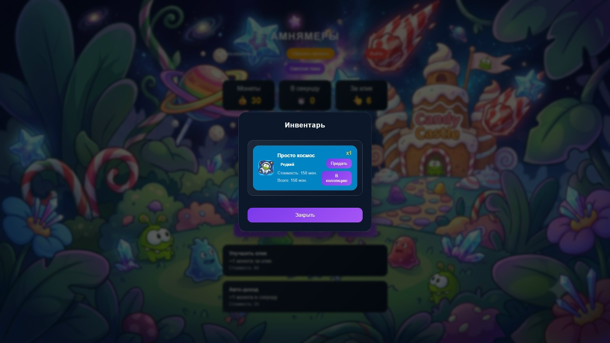
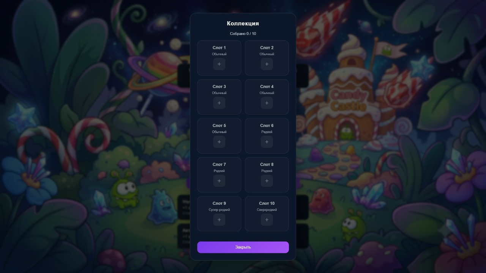
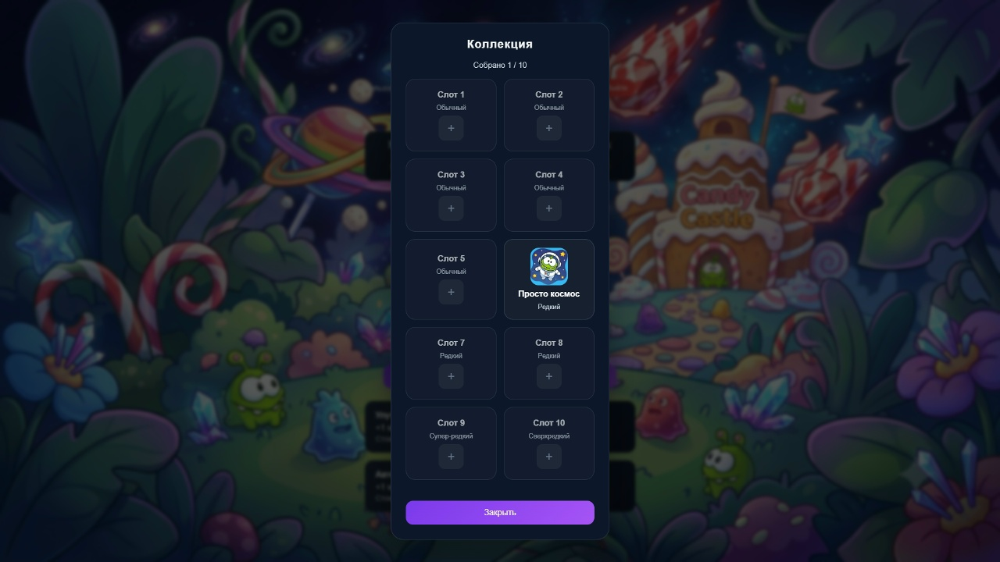

# Monster Capsule Clicker

Браузерная кликер-игра Амнямеры. Игрок зарабатывает монеты кликая по конфете, улучшает клик и авто-доход, открывает капсулы и собирает редких амнямов в коллекцию.

## Возможности

- Клик по кнопке для получения монет
- Улучшение клика и авто-дохода
- Открытие капсул с рандомными амнямами
- Инвентарь с возможностью продажи монстров
- Коллекция с редкостью и слотами для сохранения
- Сохранение прогресса локально по логину пользователя
- Переключение светлой/тёмной темы

## Технологии

- TypeScript
- Vite
- HTML/CSS

## Структура проекта

```text
src/
  config/         # Конфигурация и статические данные
  controllers/    # Контроллеры интерфейса и логики UI
  models/         # Модели состояния приложения
  services/       # Бизнес-логика и работа с данными
  types/          # TypeScript-типы и интерфейсы
  utils/          # Утилитарные функции
  main.ts         # Точка входа приложения
```

## Установка

```bash
npm install
```

## Запуск в режиме разработки

```bash
npm run dev
```

## Сборка проекта

```bash
npm run build
```

## Предпросмотр сборки

```bash
npm run preview
```

## Примечание

Прогресс сохраняется в localStorage браузера, поэтому данные доступны только на том устройстве и в том браузере, где была запущена игра.

## Скриншоты
### Вход

### Светлая/тёмная тема


### Капсула стоит 150 монет, при отсутсвии выводит соответсвующее сообщение

### Открытие капсулы



### Инвентарь и добавление в коллекцию



